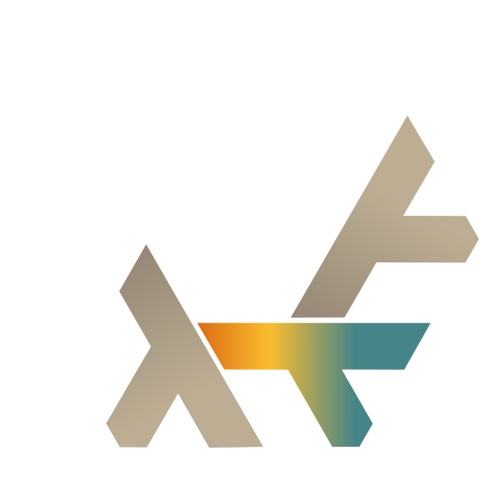
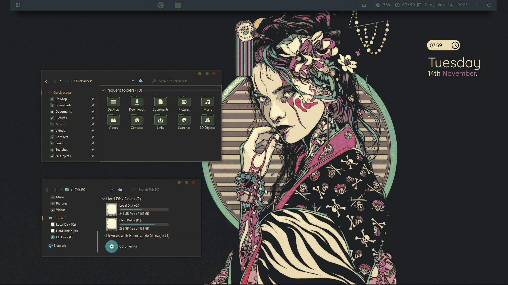

  

  <h1><samp>MK's Dotfiles</samp></h1>

   
   
   
  

  

    
  

  
*Configuration files for my GNU+Linux system.*

  

> **⚠️ Warning:**  
> This setup may not work on your machine as is.  
> Be sure to review the source packages and configuration options carefully before installing.

---

### System Information

- **OS:** Arch | NixOS  
- **Window Manager:** I3  
- **Bar:** Eww  
- **Shell:** ZSH  
- **Terminal:** Alacritty  
- **Editor:** Neovim  
- **Launcher:** Rofi  

---

## About

A custom set of personal configurations designed for NixOS and Home-Manager, leveraging the capabilities of [flakes](https://nixos.wiki/wiki/Flakes).

