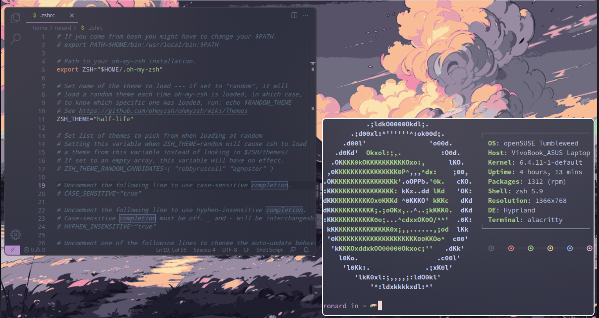

  

> [!NOTE]
>
> **System Information:**
>
> - **Window Manager:** Hyprland
> - **Shell:** ZSH
> - **Terminal:** Kitty
> - **Editor:** Neovim
> - **Launcher:** Wofi
> - **Wallpaper Manager:** Hyprpaper
> - **Lock Screen:** Hyprlock
> - **Status Bar:** Waybar
