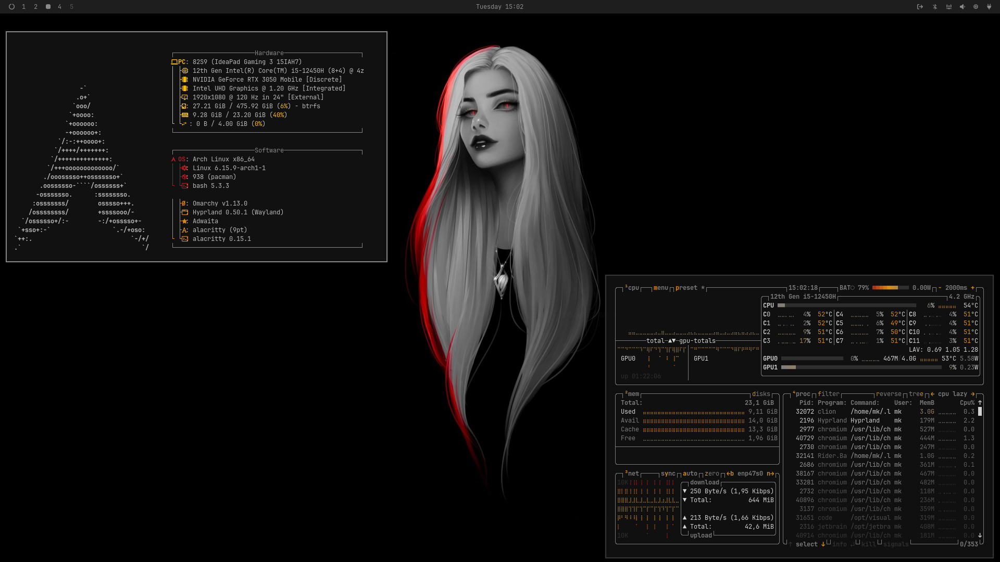

<div align="center">

  

  <h1><samp>MK's Dotfiles</samp></h1>

   
   
   
  

*Configuration files for my GNU+Linux system.*

  <p align="center">
    <a href="#">
      
    </a>
  </p>
  

  <hr>

</div>


## Installation

```bash
curl -fsSL https://raw.githubusercontent.com/MKKHLIF/.dotfiles/main/setup.sh | sudo bash
```

> **⚠️ Warning:**  
> This setup may not work on your machine as is.  
> Be sure to review the source packages and configuration options carefully before installing.

---
